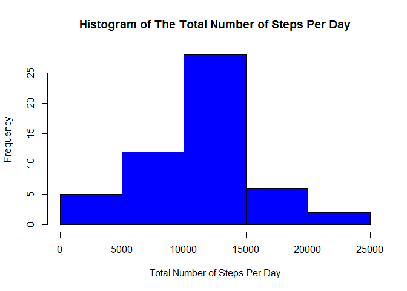
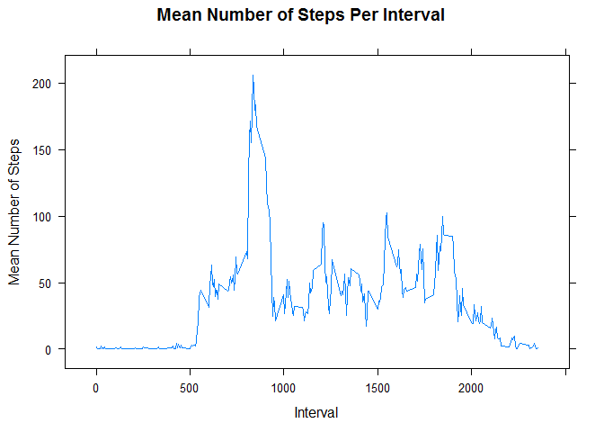
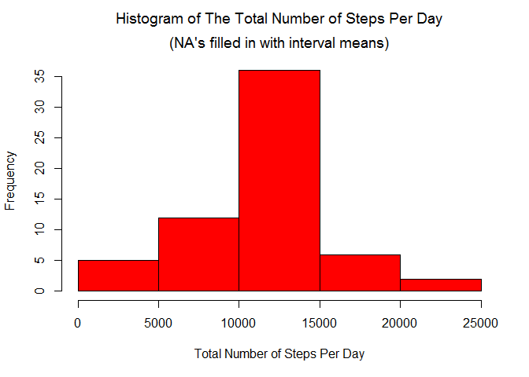
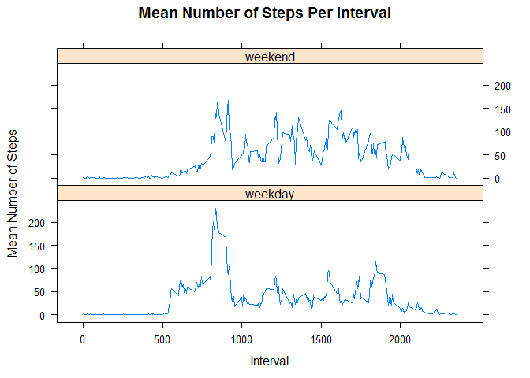

Peer Assessment 1  
========================  

Necessary libraries for the analysis of the activity.csv data


```r
library(lattice)
```

Read in the activity.csv file

```r
temp <- tempfile()
download.file("http://d396qusza40orc.cloudfront.net/repdata%2Fdata%2Factivity.zip",temp)
data <- read.csv(unz(temp, "activity.csv"))
unlink(temp)

head(data, n = 5)
```

```
##   steps       date interval
## 1    NA 2012-10-01        0
## 2    NA 2012-10-01        5
## 3    NA 2012-10-01       10
## 4    NA 2012-10-01       15
## 5    NA 2012-10-01       20
```
### **What is the total number of steps taken per day?**  

- **Make a histogram of the total number of steps taken each day**  


```r
options(scipen=999)

#Create a data frame for the total number of steps per day for the dataset
totalSteps <- aggregate(data$steps, list(data$date), "sum")

#Rename variables for the dataset containing the step totals per day
names(totalSteps) <- c("date", "total")

#Create a histogram of the total number of steps per day for the dataset
hist(totalSteps$total,
     main = "Histogram of The Total Number of Steps Per Day",
     xlab = "Total Number of Steps Per Day",
     col = "blue")
```

 


- **Calculate and report the *mean* and *median* total number of steps taken per day**  

The mean total number of steps taken per day is 10766.1887  


```r
mean(totalSteps$total, na.rm = TRUE)
```

```
## [1] 10766
```

The median total number of steps taken per day is 10765  


```r
median(totalSteps$total, na.rm = TRUE)
```

```
## [1] 10765
```

### **What is the average daily activity pattern?**

- **Make a time series plot (i.e. `type = "l"`) of the 5-minute interval (x-axis) and the average number of steps taken, averaged across all days (y-axis)**  


```r
#Create data frame for the mean number of steps per 5 minute interval
meanSteps <- aggregate(data$steps, list(data$interval), "mean", na.rm = TRUE)

#Rename the variables in meanSteps
names(meanSteps) <- c("interval", "mean")

xyplot(mean ~ interval, 
       data = meanSteps,
       type = "l",
       main = "Mean Number of Steps Per Interval",
       xlab = "Interval",
       ylab = "Mean Number of Steps")
```

 


- **Which 5-minute interval, on average across all the days in the dataset, contains the maximum number of steps?**  

The 5-minute interval, on average across all the days in the dataset, that contains the maximum number of steps is 835  


```r
meanSteps[meanSteps$mean == max(meanSteps$mean, na.rm = TRUE), "interval"]
```

```
## [1] 835
```


### **Inputing missing values**  

**Note that there are a number of days/intervals where there are missing values (coded as `NA`). The presence of missing days may introduce bias into some calculations or summaries of the data.**  

- **Calculate and report the total number of missing values in the dataset (i.e. the total number of rows with `NA`s)**  

There are 2304 missing values in the dataset  


```r
sum(is.na(data$steps) == TRUE)
```

```
## [1] 2304
```
- **Devise a strategy for filling in all of the missing values in the dataset. The strategy does not need to be sophisticated. For example, you could use the mean/median for that day, or the mean for that 5-minute interval, etc.**  

The strategy used consists of replacing the all NA's in data$steps with the mean number of steps for the corresponding time interval. Means were rounded to the nearest integer.  

- **Create a new dataset that is equal to the original dataset but with the missing data filled in.**  

A new dataset named filledData is created.  


```r
#Replace all NA's in data$steps with the mean number of steps for the corresponding time interval.
#Means were rounded to the nearest integer
filledData <- data

for(i in seq_len(length(data$steps)))
{
    if(is.na(filledData$steps[i]) == TRUE)
    {
        filledData$steps[i] <- round(meanSteps[meanSteps$interval == filledData$interval[i], "mean"], digits = 0)
    }
}

head(filledData, n = 5)
```

```
##   steps       date interval
## 1     2 2012-10-01        0
## 2     0 2012-10-01        5
## 3     0 2012-10-01       10
## 4     0 2012-10-01       15
## 5     0 2012-10-01       20
```

- **Make a histogram of the total number of steps taken each day and Calculate and report the *mean* and *median* total number of steps taken per day. Do these values differ from the estimates from the first part of the assignment? What is the impact of imputing missing data on the estimates of the total daily number of steps?**  


```r
#Create a data frame for the total number of steps per day for the new data frame (filledData) that contains no NA's
totalStepsFilled <- aggregate(filledData$steps, list(filledData$date), "sum")

#Rename variables for the data frame containing the step totals with the NA's filled in
names(totalStepsFilled) <- c("date", "total")

#Create a histogram of the total number of steps per day for the new data frame that contains no NA's
hist(totalStepsFilled$total,
     main = expression(atop("Histogram of The Total Number of Steps Per Day", "(NA's filled in with interval means)")),
     xlab = "Total Number of Steps Per Day",
     col = "red")
```

 
  
  
The mean total number of steps taken per day is 10765.6393  


```r
mean(totalStepsFilled$total)
```

```
## [1] 10766
```

The median total number of steps taken per day is 10762  


```r
median(totalStepsFilled$total)
```

```
## [1] 10762
```
Once the NA's were filled in with the mean intervals, the mean decreased by 0.5493 and the median decreased by 3


```r
mean(totalSteps$total, na.rm = TRUE) - mean(totalStepsFilled$total)
```

```
## [1] 0.5493
```

```r
median(totalSteps$total, na.rm = TRUE) - median(totalStepsFilled$total)
```

```
## [1] 3
```


### **Are there differences in activity patterns between weekdays and weekends?**  

**For this part the `weekdays()` function may be of some help here. Use the dataset with the filled-in missing values for this part.**  

- **Create a new factor variable in the dataset with two levels - "weekday" and "weekend" indicating whether a given date is a weekday or weekend day.**  


```r
#Create a new column in filledData data frame with a weekday for the corresponding value in the date column for each row
#Used as.POSIXlt() to convert values in date column from interger type to date type
filledData$weekFactor <- weekdays(as.POSIXlt(filledData$date))

#Turned the column weekFactor into a two level factor by converting Saturday and Sunday values to a weekend value and
#converting Monday-Friday values to a weekday value. Set the class of filledData$weekFactor to Factor.
for(i in seq_len(length(filledData$weekFactor)))
{
    if(filledData$weekFactor[i] == "Saturday" | filledData$weekFactor[i] == "Sunday")
    {
        filledData$weekFactor[i] <- "weekend"
    }
    else
    {
        filledData$weekFactor[i] <- "weekday"
    }
}
filledData$weekFactor <- as.factor(filledData$weekFactor)

head(filledData, n = 5)
```

```
##   steps       date interval weekFactor
## 1     2 2012-10-01        0    weekday
## 2     0 2012-10-01        5    weekday
## 3     0 2012-10-01       10    weekday
## 4     0 2012-10-01       15    weekday
## 5     0 2012-10-01       20    weekday
```

- **Make a panel plot containing a time series plot (i.e. `type = "l"`) of the 5-minute interval (x-axis) and the average number of steps taken, averaged across all weekday days or weekend days (y-axis).**  


```r
#Create data frame for the mean number of steps per 5 minute interval for the filled data
meanStepsFilled <- aggregate(filledData$steps, by = list(filledData$interval, filledData$weekFactor), "mean", na.rm = TRUE)
                             
#Rename the variables in meanSteps 
names(meanStepsFilled) <- c("interval","weekFactor", "mean")

#Create a lattice line plot comparing the mean number of steps taken per interval for weekdays vs. weekends
xyplot(mean ~ interval | weekFactor, 
       data = meanStepsFilled,
       type = "l",
       layout = c(1, 2),
       main = "Mean Number of Steps Per Interval",
       xlab = "Interval",
       ylab = "Mean Number of Steps")
```

 


